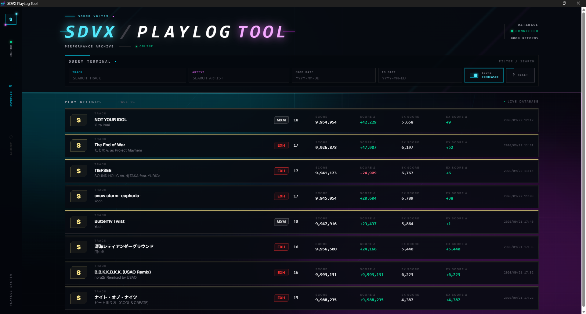
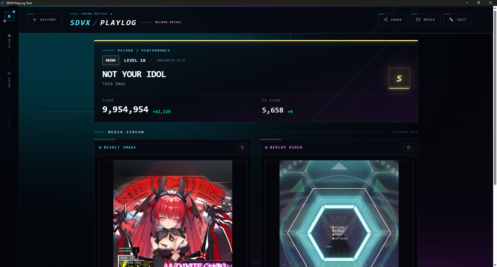

#  SDVX PlayLog Tool

<p align="center">
  <strong>🎧 SOUND VOLTEX のプレイ結果を、自動で記録・管理。</strong>
</p>

<p align="center">
  コナステ版SOUND VOLTEXのプレイ結果を自動で記録・管理するWindows向けアプリです。
</p>

<p align="center">
  
  
  
  
</p>

---

## ✦ Overview

ゲームのリザルト画面を自動検出して、**曲名・難易度・スコアなどのプレイ情報を取得**します。

取得したプレイ結果はデータベースに保存され、専用UIからプレイ履歴を確認できます。

さらに、**OBS Replay Bufferを利用したリプレイ動画の保存**にも対応しています。

<br>

```text
┌──────────────────────┐
│   SOUND VOLTEX       │
│      PLAY            │
└──────────┬───────────┘
           │
           ▼
┌──────────────────────┐
│  Result Detection    │
│  リザルト画面を検出   │
└──────────┬───────────┘
           │
           ▼
┌──────────────────────┐
│       OCR            │
│ 曲名 / 難易度 / SCORE │
└──────────┬───────────┘
           │
           ▼
┌──────────────────────┐
│      Database        │
│    プレイ履歴を保存   │
└──────────┬───────────┘
           │
           ├──────────────────┐
           ▼                  ▼
┌──────────────────┐  ┌──────────────────┐
│       UI         │  │  Replay Buffer   │
│  プレイ履歴を確認 │  │  リプレイを保存   │
└──────────────────┘  └──────────────────┘
```

---

# ✦ Screenshots

## 📊 Play History

実際のプレイ履歴を専用UIから確認できます。

<p align="center">
  
</p>

## 🎵 Play Detail

プレイ履歴から各プレイの詳細を確認できます。

<p align="center">
  
</p>

---

# ✦ Features

## 🎯 プレイ結果の自動記録

リザルト画面を検出すると、プレイ結果を自動的に取得・保存します。

* 🔍 リザルト画面を自動検出し保存
* 📝 曲名・アーティスト・難易度・レベル・スコアなどをOCRで取得
* 💾 取得したプレイ結果を自動でデータベースに保存
* 🖥️ 保存したプレイ履歴を専用UIから閲覧

---

## 🎬 リプレイ動画の保存

OBS Replay Bufferを利用して、プレイした楽曲のリプレイ動画も保存できます。

* 📹 OBS Replay Bufferを利用してリプレイ動画を自動保存
* ✂️ プレイ開始前の不要な部分を自動でトリミング
* ⌨️ リザルト画面でキー押下でリプレイ動画を保存（初期キー: `F12`）

---

# ✦ Requirements

| Requirement      | Version |
| :--------------- | :-----: |
| 🪟 Windows       |    11   |
| 🐍 Python        |   3.12  |
| 📦 uv            |    —    |
| 🟢 Node.js / npm |    —    |
| 🎥 OBS Studio    |    —    |
| ⚙️ FFmpeg        |    —    |

---

# ✦ Setup

リポジトリを取得後、PowerShellから以下を実行します。

```powershell
.\scripts\setup.ps1
```

セットアップ後の詳細な設定は以下を参照してください。

👉 [セットアップ手順（SETUP.md）](SETUP.md)

---

# ✦ Development

## 🐍 Backend

```powershell
uv run python main.py
```

## ⚛️ UI

```powershell
cd ui
npm run dev
```

## 📦 UI Build

```powershell
cd ui
npm run build
```

## 🪟 Windows Package

```powershell
cd ui
npm run dist
```

---

# ✦ Configuration

個人環境の設定は `config.yaml` で行います。

サンプル設定は `config.example.yaml` を使用します。

OBS WebSocketのパスワードは `.env` の `OBS_WEBSOCKET_PASSWORD` に設定します。

```text
config.yaml
     │
     ├── アプリ設定
     │
     └── 個人環境設定

.env
     │
     └── OBS WebSocket Password
```

---

# ✦ Runtime Data

アプリの実行データは以下に保存されます。

```text
%LOCALAPPDATA%\SDVX PlayLog Tool\data\
```

### Data Structure

```text
data/
│
├── database/    ← プレイ履歴
├── debug/       ← デバッグデータ
├── logs/        ← ログ
├── media/       ← 保存メディア
└── temp/        ← 一時ファイル
```

---

# ✦ License

Copyright © 2026 Sho Hirai.

SDVX PlayLog Tool is available for personal, non-commercial use.
You may download, install, use, and modify the software for your own
personal use.

Redistribution, sublicensing, selling, or otherwise distributing the
software or any modified version of it requires prior written permission
from the copyright holder.

Third-party software and dependencies are subject to their respective
licenses.

👉 [View License](LICENSE)

---

<p align="center">
  <sub>SDVX PlayLog Tool</sub><br>
  <sub>Automatically record. Easily manage. Keep your play history.</sub>
</p>

<div align="center">

© 2026 Sho Hirai · All Rights Reserved

</div>
